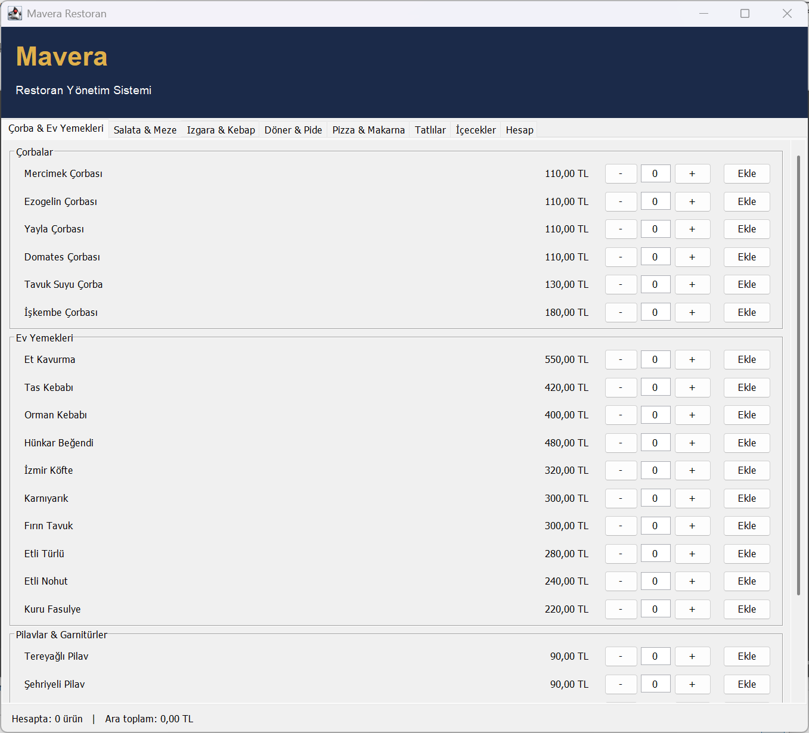
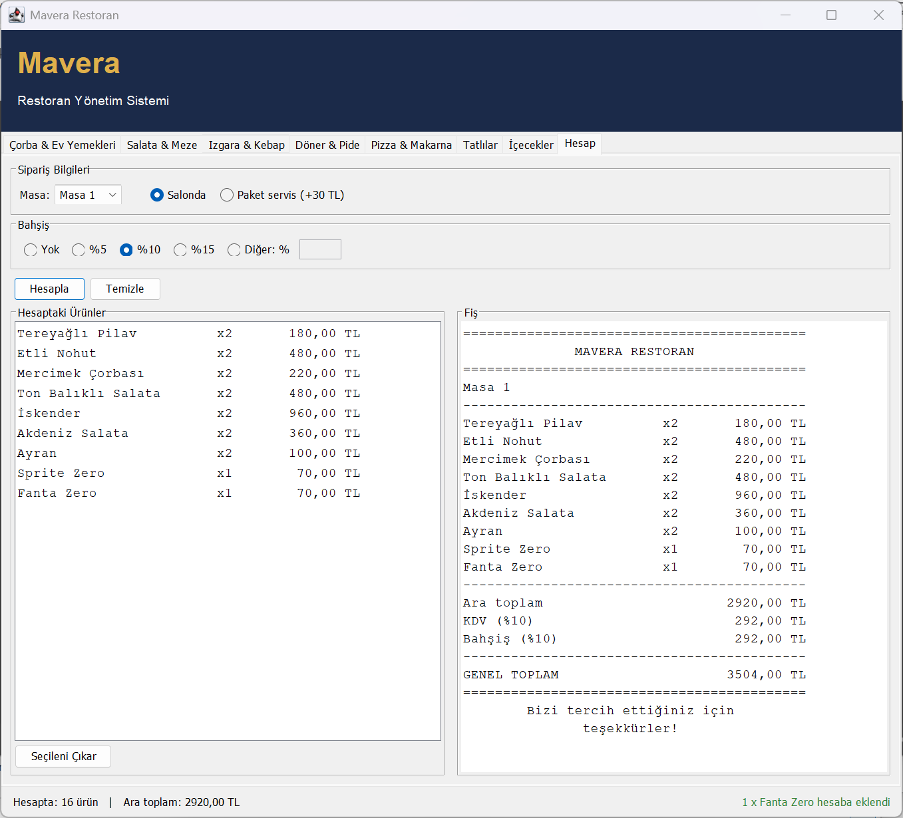

# Mavera Restoran Yönetim Sistemi

Java Swing ile yapılmış, sekmeli bir restoran adisyon uygulaması. Menüden ürünler seçilip hesaba eklenir; masa ya da paket servis, bahşiş ve KDV ile birlikte fiş hesaplanır.





## Özellikler

- 7 sekmede 19 kategori, 128 ürün (çorbalar, ev yemekleri, ızgaralar, döner, pide, pizza, makarna, tatlılar, içecekler)
- Her üründe `-` / `+` ile adet seçip **Ekle** butonu ile hesaba yazma
- Aynı ürün aynı seçenekle tekrar eklenince tek satırda birleşir; farklı seçenekler (Fanta / Fanta Zero) ayrı satırda kalır
- Hesaptaki ürünleri listeleme ve seçilen satırı hesaptan çıkarma
- Masa seçimi ya da paket servis (+30 TL)
- %5, %10, %15 ya da elle yazılan yüzdeyle bahşiş
- %10 KDV ve hizalı fiş çıktısı

## Çalıştırma

Java 11 veya üstü gerekir.

**IntelliJ IDEA ile:** Projeyi açıp `src/MaveraRestaurant.java` içindeki `main` metodunu çalıştırın.

**Komut satırından:**

```bash
cd src
javac -encoding UTF-8 *.java
java MaveraRestaurant
```

## Proje yapısı

| Dosya | Görevi |
| --- | --- |
| `MaveraRestaurant.java` | Ana pencere: başlık, sekmeler ve alttaki bilgi çubuğu |
| `RestoranMenusu.java` | Bütün menü: sekmeler, kategoriler, ürünler ve fiyatlar |
| `UrunSatiri.java` | Menüdeki tek bir ürün satırı (adet, seçenekler, Ekle butonu) |
| `HesapPaneli.java` | Hesap sekmesi: hesaptaki ürünler, masa / paket, bahşiş ve fiş |
| `Sepet.java` | Hesaba eklenen ürünleri tutar, değişince ekranı haberdar eder |
| `HesapMakinesi.java` | Ara toplam, KDV, bahşiş ve fiş metni (arayüzden bağımsız) |
| `Urun.java`, `Kategori.java`, `SiparisKalemi.java` | Veri sınıfları |

Menüye ürün eklemek, fiyat değiştirmek ya da yeni bir sekme açmak için sadece `RestoranMenusu.java` dosyasını düzenlemek yeterli; ekran kendiliğinden güncellenir.

## Notlar
- Bu projede KDV, Türkiye'deki uygulamanın aksine fiyatlara dahil değildir; hesap tutarının %10'u olarak fişe ayrıca eklenir.
- Masa seçimi fişe yazılan bir bilgidir; her masa için ayrı adisyon tutulmaz.
- Pencere en az 640×480 olabilir. 800 pikselden dar pencerelerde "İçecekler" sekmesinde yatay kaydırma çubuğu çıkar.